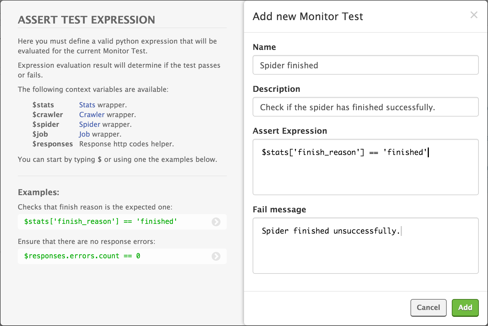
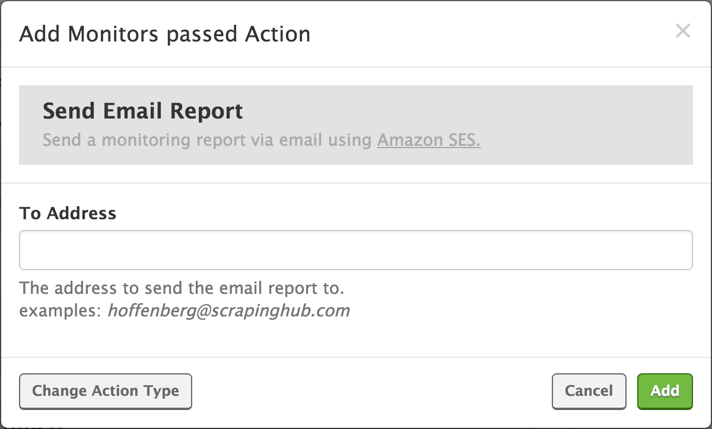

.. _addons:

======
Addons
======

Addons allow to extend bot capabilities and configure them easily from Scrapinghub. Each addon provides a particular feature. There are two flavours of addons: builtin addons and user addons. Builtin addons are always enabled and cannot be disabled by users.

Addons are very popular among Autoscraping users as a way of obtaining additional functionality without writing any code. Scrapy Cloud users often tend to write the extensions themselves. In fact, addons are no more than a fancy UI to configure `Scrapy`_ extensions.

To put an addon to use, you have to:

    #. Add it to your project, by going to **Settings -> Addons** in the Scrapinghub dashboard.
    #. Enable it. Some addons are enabled automatically when added, while others require configuring (e.g. editing ``ADDON_ENABLED`` setting). It should be clear from the addon page in the dashboard which case it is.

You can also enable addons per spider, instead of project-wide: select the spider in **Spiders** section, click **Settings** tab (next to **Details**), click ``+`` button in the corresponding addon field to add a new entry and choose ``ADDON_ENABLED`` from the list of options.

.. _autothrottle-addon:

Autothrottle
============

Allows the bot to crawl the target site with more caution, by dynamically adjusting request concurrency and delay according to the site lag and user control parameters. For details see `Scrapy Autothrottle`_ documentation.

This addon is loaded by default in every project. The basic settings controlling its behaviour are:

* ``CONCURRENT_REQUESTS_PER_DOMAIN`` - limits the maximum number of concurrent requests sent to the same host domain (default value is ``8``)
* ``DOWNLOAD_DELAY`` - limits the minimum download delay (in seconds) between each burst of requests (default value is ``0``)
* ``AUTOTHROTTLE_ENABLED`` - enables or disables *Autothrottle* addon (default value is ``True``, i.e. enabled)

**How to adjust these parameters?** The settings greatly depend on the user's needs, there are no values that will work for any target server. The default values are in general a good starting point and most servers tolerate them. Still there's a possibility of blocking and a need to slow down the crawling rate may emerge. Or quite the contrary, you may want the bot to crawl faster, in such instance you should fully realize that the risk of blocking increases. 

The crawling rate may be slowed down by adjusting the maximum concurrency ``CONCURRENT_REQUESTS_PER_DOMAIN`` to ``1``, and increasing the minimum download delay ``DOWNLOAD_DELAY`` at will. Regarding the maximum effective crawling rate, in practice it will be limited to the target server response rate, but may try to
speed it up by randomly increasing maximum concurrency (although in reality it produces no significant effect as concurrency will hardly exceed 2 for most sites).

As *Autothrottle* dynamically adjusts delay and concurrency depending on the site lag, the parameters only define limits while not forcing values. The minimum download delay value will not let the effective download delay take lower values during crawling, and the maximum concurrency value will not let the effective concurrency take higher ones. If there's a need for fixed values, *Autothrottle* and its functionality of adjusting effective parameters during crawling have to be disabled by setting ``AUTOTHROTTLE_ENABLED`` to ``False``. Under such conditions, the settings ``CONCURRENT_REQUESTS_PER_DOMAIN`` and ``DOWNLOAD_DELAY`` may be redefined with required values. But be warned, you will be doing so at your own risk -- as stated before, increasing the crawling rate results in considerably increasing the probability to being blocked by the target site. Scrapinghub advocates courtesy when crawling the sites.

DeltaFetch
==========

.. important:: You'll need to enable the `DotScrapy Persistence`_ add on for DeltaFetch to work. 

The purpose of this addon is to ignore requests to pages containing items seen in previous crawls of the same spider, thus producing a *delta crawl* containing only new items. For more details on the algorithm, you can check `DeltaFetch code`_.

There are two main settings for controlling this addon:

* ``DELTAFETCH_ENABLED`` - enables or disables *DeltaFetch* addon (either project-wide or per spider)
* ``DELTAFETCH_RESET`` - reset the state, forgetting visited pages in previous runs (remember to remove this setting once you complete a crawl with this setting activated)

You can change how DeltaFetch detects duplicate requests by setting the ``deltafetch_key`` key in the Request meta parameter. Example::

    Request(url, meta={'deltafetch_key': SOME_UNIQUE_KEY})

The ``deltafetch_key`` value is used as a unique identifier for the request. If ``deltafetch_key`` is unspecified then the request fingerprint (see ``scrapy.utils.request.fingerprint``) is used instead. 

.. note:: DeltaFetch only checks for duplicate URLs of requests that contain items. Requests to URLs that haven't yielded items will still be revisited in subsequent crawls. Start URLs will also be revisited.

DotScrapy Persistence
=====================

This addon keeps the content of the ``.scrapy`` directory in a persistent store, which is loaded when the spider starts and saved when the spider finishes. It allows spiders to share data between different runs, keeping a state or any kind of data that needs to be persisted.

The ``.scrapy`` directory is well known in Scrapy and a few extensions use it to keep a state between runs. The canonical way to work with the ``.scrapy`` directory is by calling the ``scrapy.utils.project.data_path`` function, as illustrated in the following example::

    from scrapy.utils.project import data_path

    mydata_path = data_path()

    # ... use mydata_path to store or read data which will be persisted among runs ...

Supported settings:

* ``DOTSCRAPY_ENABLED`` - enables or disables *DotScrapy* addon (either project-wide or per spider)

Images
======

This addon downloads images from extracted image URLs and stores them into an Amazon S3 storage. The addon is enabled by updating the ``IMAGES_STORE`` setting and defining two item fields:

* ``image_urls`` with type *image*, which is used for annotating image URLs in the template. This will be the source field from which the addon will get URLs of the images to be downloaded.
* ``images``, where the addon will save important information about the stored image, including Amazon S3 path relative to the ``IMAGES_STORE`` setting and the original image URL. The type of this field doesn't matter, as it is defined by the pipeline, not by the *AS* extraction algorithm. That said, be sure that it is **NOT** flagged as required, otherwise the data will not be extracted, because you will not be able to annotate this field in the templates.

Those field names are the default ones, but can be overriden with the settings ``IMAGES_URLS_FIELD`` and ``IMAGES_RESULT_FIELD``. The source and target fields defined by these two settings do not need to be different -- you can make both be the same. It will ease you from defining an additional field in the item. The addon will just overwrite the data extracted by *AS* with the data it generates (which is a dict already including the origin URL).

Settings:

* ``IMAGES_STORE`` - provide a complete Amazon S3 base path (in format *s3://<bucket name>/<base path>/*) where the images should be stored
* ``IMAGES_MIN_WIDTH`` - images with a smaller width (in pixels) are ignored (default value is ``0``)
* ``IMAGES_MIN_HEIGHT`` - images with a smaller height (in pixels) are ignored (default value is ``0``)
* ``IMAGES_EXPIRES`` - when an image is already in store, update it only when its age is older than the given value in days (default value is ``90``)
* ``IMAGES_URLS_FIELD`` - specify the item field from which the addon will read the image URLs to download/store (default value is ``image_urls``)
* ``IMAGES_RESULT_FIELD`` - specify the item field where the addon will save the stored image information (default value is ``images``)

You will also need to provide the standard ``AWS_ACCESS_KEY_ID`` and ``AWS_SECRET_ACCESS_KEY`` settings so the addon will be able to upload the images in your
Amazon S3 storage.

For more details refer to `Scrapy Images Pipeline`_, since *Images* addon is based on it.

.. _querycleaner:

Query Cleaner
=============

*Query Cleaner* addon allows to clean up the request URL GET query parameters at the output of the spider in accordance with the patterns provided by the user.

In order to enable it, use at least one of the addon-specific settings: ``QUERYCLEANER_REMOVE`` or ``QUERYCLEANER_KEEP``. The first one specifies a pattern (regular expression) that a query parameter name must match in order to be removed from the URL (all the others will be accepted). And the second one specifies a pattern that a query parameter name must match in order to be kept in the URL (all the others will be removed). You can combine both if some query parameters patterns should be kept and some should not. The *remove* pattern has precedence over the *keep* one.

Note that you can specify a list of parameter names by using the ``|`` (*OR*) regex operator. For example, the pattern ``search|login|postid`` will match query parameters *search*, *login* and *postid*. This is by far the most common usage case. And by setting ``QUERYCLEANER_REMOVE`` value to ``.*`` you can completely remove all URL queries.

Supported settings:

* ``QUERYCLEANER_REMOVE``
* ``QUERYCLEANER_KEEP``

The addon is implicitly enabled when one of these settings is provided.

Let's suppose that the spider extracts URLs like::

    http://www.example.com/product.php?pid=135&cid=12&ttda=12

We want to leave only the parameter ``pid``. To achieve this objective we can use either ``QUERYCLEANER_REMOVE`` or ``QUERYCLEANER_KEEP``. In the first case, the pattern would be ``cid|ttda``. In the second case, ``pid``. The best solution depends on a particular case, that is, how the query filters will affect any other URL that the spider is expected to extract.

.. _Scrapy: https://github.com/scrapy/scrapy
.. _DeltaFetch code:  https://github.com/scrapinghub/scrapylib/blob/master/scrapylib/deltafetch.py
.. _`Scrapy Autothrottle`: https://scrapy.readthedocs.org/en/latest/topics/autothrottle.html
.. _`Scrapy Images Pipeline`: http://doc.scrapy.org/en/latest/topics/images.html

Monitoring
==========

The *Monitoring* addon lets you monitor your spiders, generate reports and send notifications. It works by allowing you to set one or more actions to execute on a certain job event. 

``Monitors`` consist of one or tests that check for one or more conditions. You can create a Monitor by clicking the ``Add monitor`` button. To then add a test to the monitor, click ``Add test``. Here you can enter a name and description, as well as an assert expression and fail message. The assert expression is used to check whether the test passed or failed. The fail message will be included in the report.

In the ``Actions`` tab you can set up actions to occur when a certain event is triggered. The following triggers are available:

=============== ===========================================
Event           Description
=============== ===========================================
Spider started  Run actions when a spider starts.
Spider finished Run actions when a spider finishes
Monitors passed Run actions when all monitors pass.
Monitors failed Run actions when one or more monitors fail.
=============== ===========================================

You can set up actions to occur when a spider starts or finishes, or when all monitors pass or one or more fails. Let's walk through setting up a monitor that will send an email notification if a spider fails.

First create a monitor, and click the ``Add test`` button.

The ``Assert Expression`` field is where we write the logic to check the spider condition. The example below return true if the spider close reason is 'finished', otherwise it will return false::

    $stats['finish_reason'] == 'finished'

We can also add a fail message which will be included in the email report. Save the test, and click on the ``Actions`` tab. 

Because we want to be notified when the test fails, we need to add a ``Monitors failed`` action. Click ``Add action`` and you'll see this dialogue:

You can see we have a number of actions to choose from. Select the ``Send email notification`` option, and then enter your email address. Click ``Save`` and we're done!

