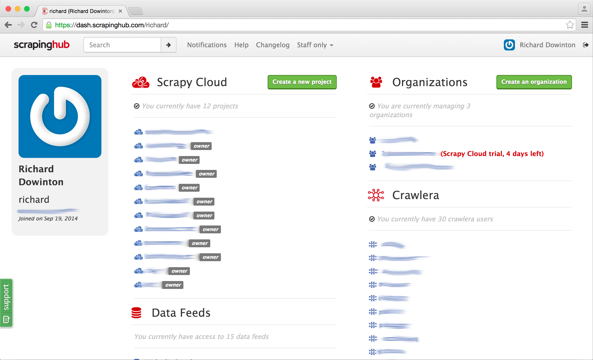
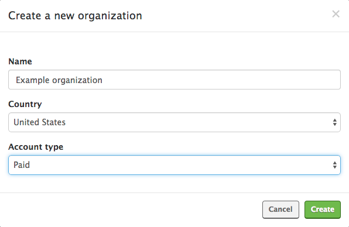
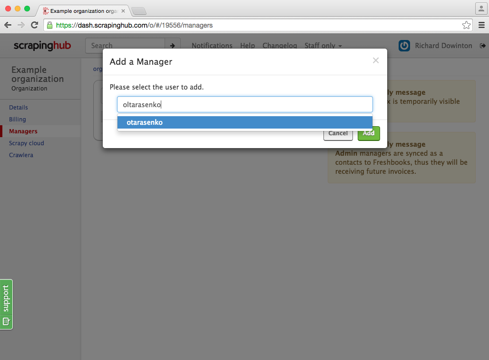
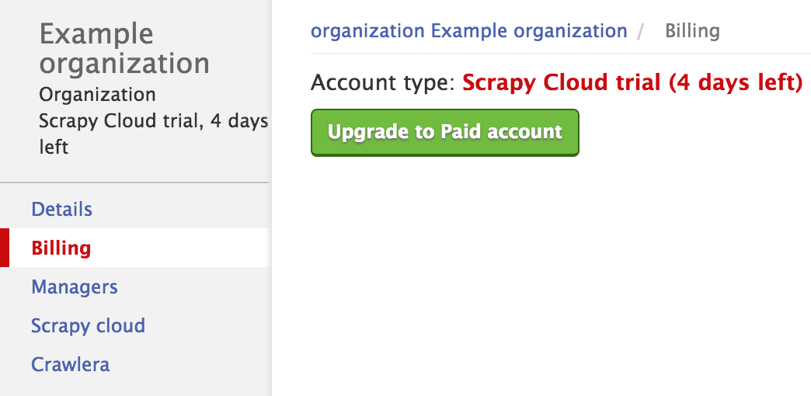
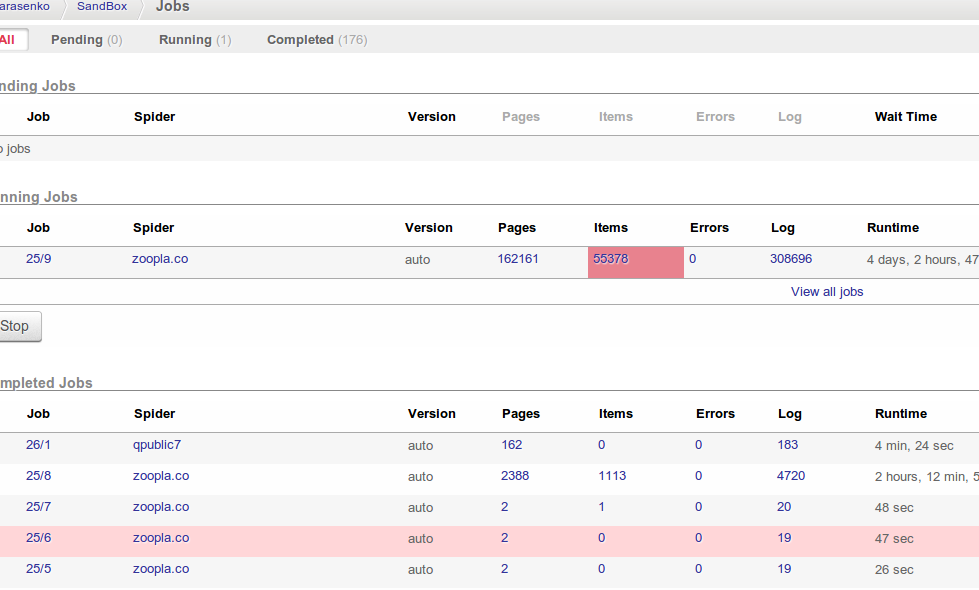
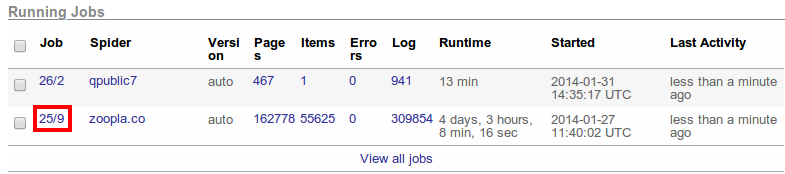
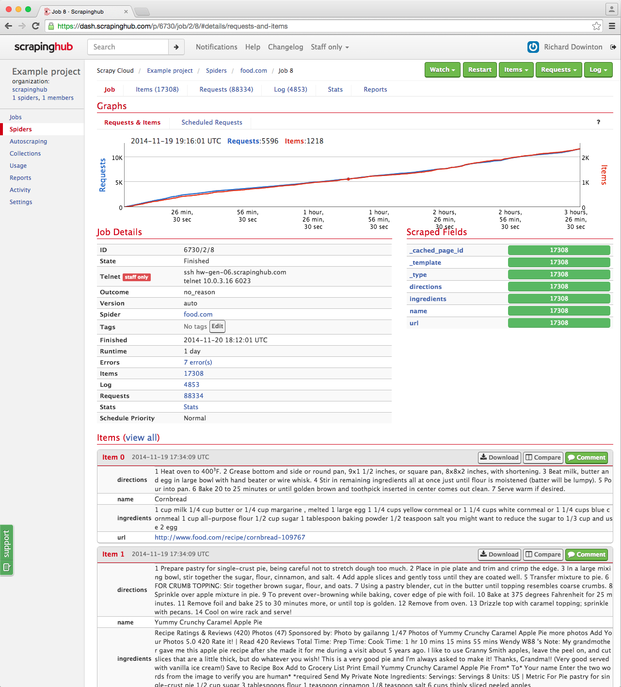
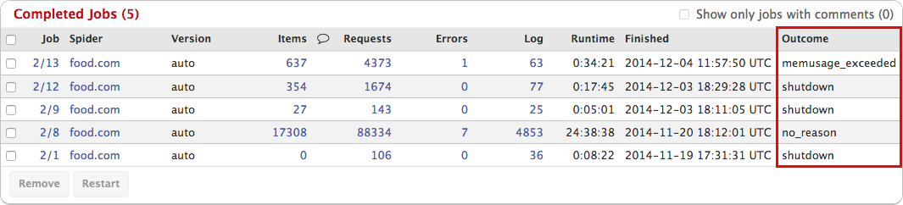
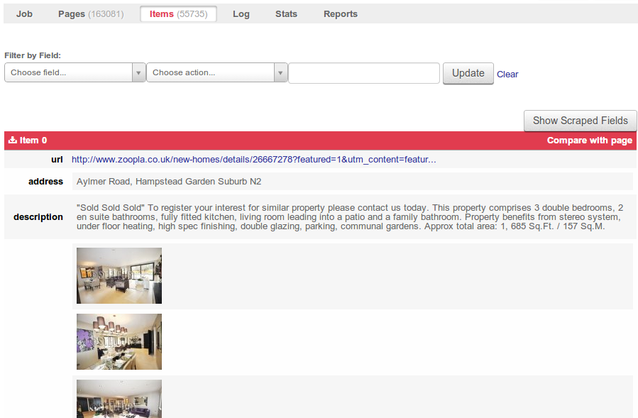
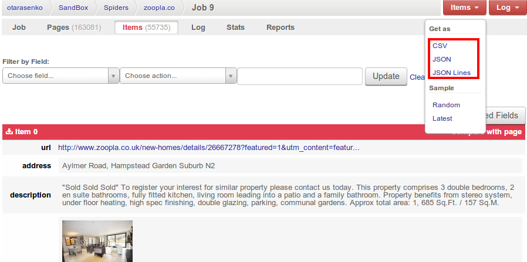

.. _dash:

=============
The Dashboard
=============

The `Scrapinghub Dashboard`_ allows you to control and monitor your spiders, as well as other Scrapinghub services such as Crawlera.

When you login to Scrapinghub, you go to your home page (also known as your profile page). There you can see all your Scrapy Cloud projects and Crawlera users:

|

Organizations
=============

Before you create your first project, you will need to create an organization. An organization represents a group of users collaborating on one or more projects. To create an organization, click the 'Create an organization' button at the top right of the Scrapinghub homepage. You can only have one trial organization, and once its has expired you will no longer be able to create projects under that organization. If you create a project before having created an organization, you can choose 'Create a default Scrapy Cloud trial organization' and a default organization will be created using your username.

Billing is done per organization, so if you are using a paid account you will receive a separate invoice for each organization you own. You can invite users to your organization's project without them belonging to the organization. If you need other people to be able to create projects under your organization, you can add them as a manager:

If you want to upgrade to a paid account, you can do so on your organization's billing page:

Crawlera accounts are linked to organizations rather than users. When signing up for Crawlera your user will be linked to your organization. If you wish to move a Crawlera user to a different organization, please contact support. 

The Search Bar
==============

You can use the search bar to jump quickly to any project, user or Crawlera account.

.. image:: _static/dash-search.png
   :width: 400px

|

Jobs Dashboard
==============

The **Jobs** dashboard can be used to monitor and control your spiders.

To schedule a spider for running select the spider in the **Schedule** box and click the `Schedule` button.

If you click on any project, you go to the **Jobs** dashboard page where you will see the spider jobs that are completed, running or pending to run.

|

* **Pending Jobs** - the list of jobs that are waiting to start. Jobs may not start immediately after being scheduled, sometimes they must wait for resources to be available. If you need better capacity guarantees, consider purchasing a dedicated server.

* **Running Jobs** - the list of jobs that are currently running.

* **Completed Jobs** - the latest completed jobs.

Job Page
========

|

Clicking on any job ID (see the picture above) will take you to the job page, where you can see stats about the job alongside items scraped from it:

|

Job Outcomes
============

The job outcome indicates whether the job succeeded or failed. By default, it contains the value of the spider close reason from Scrapy. It's available in the table of completed jobs:

|

Here is a summary of the Scrapinghub built-in job outcomes. Click on the name
for more details about the outcome.

==========================   ===============================================================
Outcome                      Meaning
==========================   ===============================================================
`finished`_                  the job finished successfully
`failed`_                    the job failed to start
`shutdown`_                  the job was cancelled manually
`cancel_timeout`_            the job was cancelled due to inactivity
`memusage_exceeded`_         the job was cancelled due to high memory usage
`slybot_fewitems_scraped`_   the job was not scraping enough data (:doc:`portia` specific)
==========================   ===============================================================

finished
--------

The job finished successfully. However, it may have produced errors, which you
can inspect through the logs.

failed
------

The job failed to start, typically due to a bug in the spider's code. Check the
last lines of the job log for more information.

shutdown
--------

The job was cancelled manually, either from :ref:`the dashboard <dash>` or the
:ref:`API <api>`. Incidentally, this is the same close reason used by Scrapy
when terminating a spider pressing ``Ctrl-C``.

cancel_timeout
--------------

The job was cancelled because either it has failed to shutdown gracefully after
cancellation (taking more than 5 minutes) or it hasn't been producing anything
(not even log entries) for an hour.

memusage_exceeded
-----------------

The job was consuming too much memory, exceeding the limit (512 Mb by default),
and it was cancelled by the system. This typically happens with spiders that
don't use memory efficiently (keeping state or references that grow quickly
over time) and it's most often manifested on long spider runs of many pages.
This outcome is triggered by Scrapy's `Memory Usage Extension`_.

slybot_fewitems_scraped
-----------------------

The job was cancelled because it wasn't scraping enough new data. This is used
in :ref:`portia` to prevent infinite crawling loops.

Items Browser
=============

You can review items by clicking on the **Items** tab:

|

You can also download the items in CSV or JSON format through the **Items** menu:

|

This covers the basics of the dashboard, but there is much more. Feel free to play around and check our `knowledge base`_ for more information on specific topics. If you have any questions, don't hesitate to ask them in the `support forum`_.

.. _`Scrapinghub dashboard`: https://dash.scrapinghub.com/
.. _`knowledge base`: http://support.scrapinghub.com/forum/24895-knowledge-base/
.. _`support forum`: http://support.scrapinghub.com/
.. _`Memory Usage Extension`: http://doc.scrapy.org/en/latest/topics/extensions.html#module-scrapy.contrib.memusage
