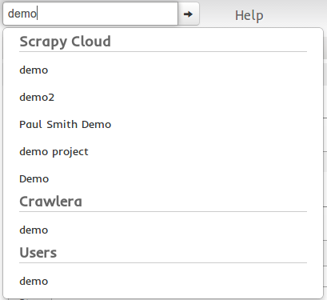
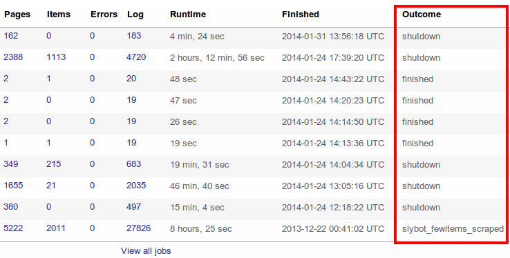

.. _dash:

=========
Dashboard
=========

The `Scrapinghub dashboard`_ (or "Dash" for short) allows you to control and
monitor your spiders, as well as other Scrapinghub services such as Crawlera.

When you login to dash, you go to your home page (also known as your profile
page). There you can see all your Scrapy Cloud projects and Crawlera users:

.. image:: _static/dash-home.png
   :width: 500px

The search bar
==============

You can use the search bar to jump quickly to any project, user or Crawlera
account.

The jobs dashboard can be used to monitor and control your spiders.

To schedule a spider for running select the spider in the `Scheduler spider`
box and click the `Schedule` button.

Jobs dashboard
==============

If you click on any project you go to the jobs dashboard page where you will
see the spider jobs that are running, pending to run and finished.

.. image:: _static/dash-jobs.png
   :width: 500px

* **Pending Jobs** - the jobs that are waiting to start. Jobs may not start
  immediately after being scheduled, sometimes they must wait for resources to
  be available. If you need better capacity guarantees consider purchasing a
  dedicated server.

* **Running Jobs** - running jobs is the list of jobs that are currently
  running.

* **Completed jobs** - the latest completed jobs.

Job page
========

Clicking on any job ID:

.. image:: _static/dash-job-click.png
   :width: 500px

Will take you to the job page where you can see stats about the job alongside
items scraped from it:

.. image:: _static/dash-jobpage.png
   :width: 500px

Job outcomes
============

The job outcome indicates whether the job succeeded or failed. By default, it
contains the value of the spider close reason from Scrapy. It's available in
table of finished jobs:

These are the most common job outcomes and their meanings:

* ``finished`` - the job finished successfully (it may contain errors though)

* ``shutdown`` - the job was cancelled, either from the Dash or due to
  Scrapinghub internal maintenance

* ``failed`` - the job failed for some reason. The most likely situation is
  that the crawling process failed to start due to a bug in the project's code.
  Check the last lines of the job log for more info.

* ``killed`` - the job was killed by Scrapinghub because it failed to respond
  or because it failed to shutdown gracefully

* ``slybot_fewitems_scraped`` - this is an autoscraping specific outcome. Please refer
  to the :doc:`autoscraping` help document.

Items browser
=============

You can review items by clicking on the Items tab:

.. image:: _static/dash-items.png
   :width: 500px

You can also download the items in CSV or JSON format through the Items menu:

.. image:: _static/dash-items-download.png
   :width: 500px

This covers the basics of the dashboard, but there is much more. Feel free to
play around and check our `knowledge base`_ for more information on specific
topics. If you have any question, don't hesitate to ask in the `support
forum`_.

.. _`Scrapinghub dashboard`: https://dash.scrapinghub.com/
.. _`knowledge base`: http://support.scrapinghub.com/
.. _`support forum`: http://support.scrapinghub.com/
