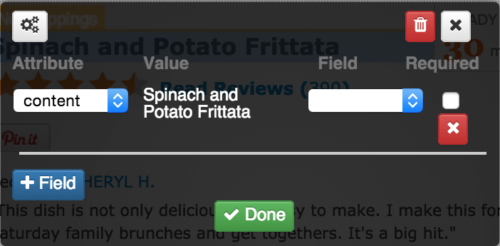
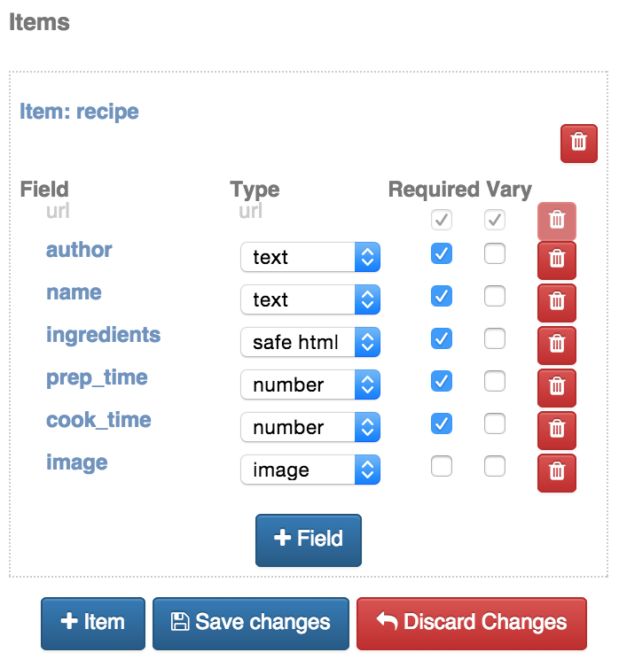
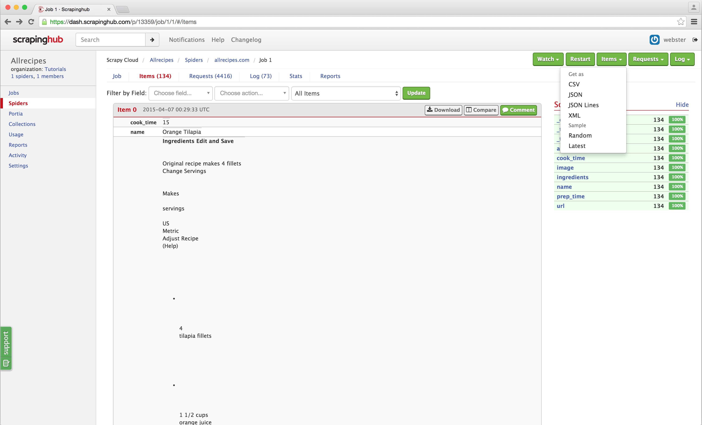

.. _portia:

======
Portia
======

Portia let's you create spiders through a visual interface and then export them to Scrapy Cloud. This page mostly covers using Portia with Scrapinghub, for information on how Portia itself works take a look at the `documentation <https://github.com/scrapinghub/portia>`_.
There also is a tutorial on how to use Portia on `vimeo <https://vimeo.com/129663101>`_ that will help you get started.

.. raw:: html

  <iframe src="https://player.vimeo.com/video/129663101" width="500" height="281" frameborder="0" webkitallowfullscreen mozallowfullscreen allowfullscreen></iframe> 
<a href="https://vimeo.com/129663101">Build a spider with Portia for allrecipes.com</a> from <a href="https://vimeo.com/scrapinghub">Scrapinghub</a> on <a href="https://vimeo.com">Vimeo</a>.

Creating a Portia Project
=========================

You can create a new Portia project from Scrapinghub's homepage. When you create a new project, you will be redirected to Portia and can begin creating spiders. Existing spiders can be accessed on the right.

If you want to create Portia spiders within an existing project, you can enable Portia in the project's Addons section. You can then access Portia by clicking the Portia tab on the left.

Spiders, Templates and Items
============================

You can create a spider from the project context by entering the URL in Portia's address bar and clicking 'New spider'. Portia will render the page and set the spider's URL to the one you entered.

On the right you'll find the spider settings toolbox. Here you can define your spider's crawling behaviour, start URLs, and login information if required by the target website.

When you first annotate a page, a template will be created. Templates are used to model a web page and define which data you want to extract from it. Templates are made up of annotations, which define a mapping between an element on the page and the extracted item's field. 

You can create an annotation by clicking on an element, and then map the element's content or one of its attributes to a field of the item you're wanting to extract.

The extracted item type can be set on the right hand side, under 'Extracted item type'. Here you can also modify the item's fields if necessary.

An item refers to a single item of data scraped from the target website, such as a product, job listing etc. In Portia, items are extracted per template, so it's possible to scrape multiple item types if you use a different template for each one.

Even if you're only extracting a single item, in many cases you will need to use more than one template. This is because a lot of websites use different layouts depending on the content being displayed, and in some cases the layout may differ between items you're extracting.

Extractors allow you to further refine field values extracted from a page using regexes or a predefined type. This is useful if you only want a subselection of an element's content or attribute.

Publishing to Scrapinghub
=========================

Once your have tested your spiders, you're ready to publish your project to Scrapinghub. Click the project name in the breadcrumbs on the top left to enter the project context. From here you can click the 'Publish changes' button found in the toolbox menu on the right.

When you publish your project, if successful you will be asked if you want to be redirected to the schedule page. Click 'OK' and you will be taken to the spiders page in Scrapinghub, here you can schedule your spider by clicking the 'Schedule' button located at the top right.

Portia spiders run just like any Scrapy spider, and you can view the results when the job is complete.

Magic Fields
============

Sometimes, you need to add certain fields to your data. For example, you may need a timestamp for when an item was scraped, or you need to extract an identifier from a URL. This is where the Magic Fields addon comes in.

You can enable the addon by going to ``Settings -> Addons`` and clicking ``Add`` on the Magic Fields addon.

Navigate to the settings of the spider you want to modify. Let's use the ``$time`` magic variable as an example.

Add ``{ 'timestamp': '$time' }`` to the ``MAGIC_FIELDS`` setting. This will add a ``timestamp`` field containing the time at which the item was scraped.

The following magic variables are available:

======================= ===========
Name                    Description
======================= ===========
time                    The UTC timestamp at which the item was scraped, in the format '%Y-%m-%d %H:%M:%S'.
unixtime                The Unix time at which the item was scraped.
isotime                 The UTC timestamp at which the item was scraped, in the format '%Y-%m-%dT%H:%M:%S'.
spider:<attribute>      The value of the specified attribute argument. 
env:<variable>          The value of the specified variable. Note: the name of the variable will be omitted.
jobid                   The job ID. Shortcut for $env:SCRAPY_JOB.
jobtime                 The UTC timestamp at which the job started, in the format '%Y-%m-%d %H:%M:%S'.
setting:<name>          The value for the specified setting.
field:<name>            The value of the existing field specified.
response:<property>     The value of the specified property of the response.
======================= ===========

You can also use regular expressions to extract a portion of the variable. 

For example, let's say you need to extract a parameter from a URL like this: ``http://www.example.com/product.html?item_no=345``. The normal syntax, ``{ 'sku': '$field:url' }`` will store the full URL into the ``sku`` field. If we want to extract only the ``item_no`` value, we can use a regex like this: ``{ 'sku': "$field:url,r'item_no=(\d+)'" }``

