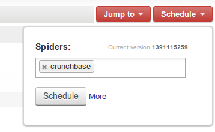
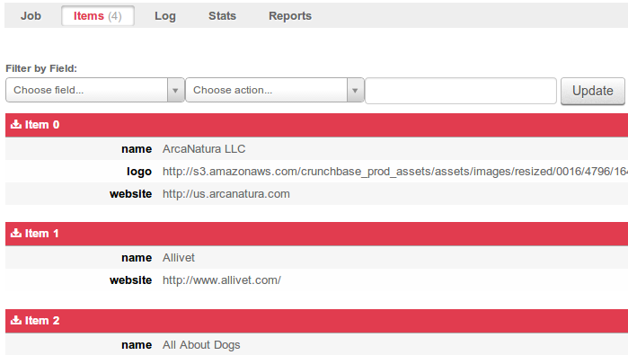

============
Scrapy Cloud
============

*Scrapy Cloud* is a service provided by the Scrapinghub platform that allows to
deploy and run `Scrapy`_ spiders.

Creating a Scrapy spider
========================

Let's start by creating our Scrapy spider. If you already have a Scrapy
project, you can skip this section.

This assumes you have Scrapy already installed, otherwise please refer to the
`Scrapy installation guide`_.

For this example, we will build a spider to scrape the *CrunchBase* directory.
For simplicity sake, we are going to restrict it to the *Pets* category:

    http://www.crunchbase.com/companies?q=pets

We begin by creating a Scrapy project which we will call ``companies``::

    $ scrapy startproject companies

Then we create a spider for ``crunchbase.com``::

    $ scrapy genspider crunchbase crunchbase.com -t basic
    Created spider 'crunchbase' using template 'basic' in module:
      companies.spiders.crunchbase

Then we edit the spider::

    $ scrapy edit crunchbase

Here is the code (for simplicity we are defining the item in the same file):

.. literalinclude:: _static/sc-crunchbase.py

For more information about Scrapy please refer to the `Scrapy documentation`_.

Deploying a Scrapy spider
=========================

The next step is to edit ``scrapy.cfg`` file of your project and configure
Scrapinghub as deployment target::

    [settings]
    default = companies.settings

    [deploy]
    url = http://dash.scrapinghub.com/api/scrapyd/
    project = PROJECT_ID

``PROJECT_ID`` is the numeric project ID which you can find in Scrapinghub URL:

    http://dash.scrapinghub.com/p/PROJECT_ID/...

Then you should put your API key (which you can get from your `Account page`_)
in ``~/.scrapy.cfg`` to authenticate::

    [deploy]
    username = APIKEY

Finally, you deploy your spider to Scrapinghub with::

    $ scrapy deploy
    Server response (200):
    {"status": "ok", "project": PROJECT_ID, "version": "1391115259", "spiders": 1}

Now you should go to your project page and schedule the spider to run:

Once the job has finished, or while it's running, you can click on the job to
review the scraped data and other information about the job:

Dependencies and External Libraries
===================================

If your project needs code from an external Python library, you need to upload
a Python egg of that dependency.

See `setuptools`_ for details about egg concepts, preparation and building. If
you want to provide your own library for your project, proceed as described below:

#. Write your code.
#. Add a ``setup.py`` file in the base package folder, e.g.::

    from setuptools import setup, find_packages
    setup(
        name = "mylibrary",
        version = "0.1",
        packages = find_packages(),
    )

#. Run ``python setup.py bdist_egg`` to deploy in your project.
#. In Dash, go to *Settings -> Eggs -> Add Egg*, and fill the requested data in the upload form.

.. _Scrapy: http://scrapy.org
.. _Scrapy installation guide: http://doc.scrapy.org/en/latest/intro/install.html
.. _account page: http://dash.scrapinghub.com/account/
.. _Scrapy documentation: http://doc.scrapy.org/
.. _setuptools: http://peak.telecommunity.com/DevCenter/setuptools
